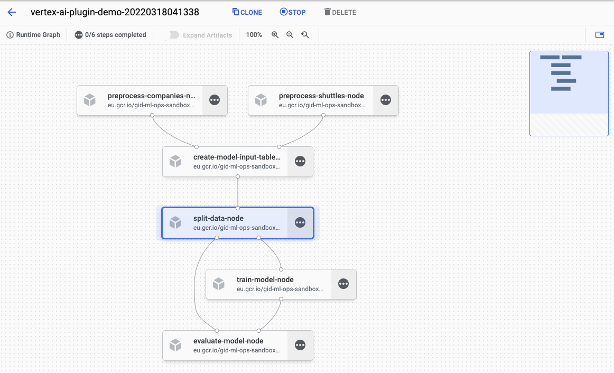

# Quickstart

## Preprequisites

The quickstart assumes user have access to Vertex AI Pipelines service. 

## Install the toy project with Vertex AI Pipelines support

It is a good practice to start by creating a new virtualenv before installing new packages. Therefore, use `virtalenv` command to create new env and activate it:

```console
$ virtualenv venv-demo
created virtual environment CPython3.8.12.final.0-64 in 764ms
  creator CPython3Posix(dest=/home/getindata/kedro/venv-demo, clear=False, no_vcs_ignore=False, global=False)
  seeder FromAppData(download=False, pip=bundle, setuptools=bundle, wheel=bundle, via=copy)
    added seed packages: pip==22.0.4, setuptools==60.9.3, wheel==0.37.1
  activators BashActivator,CShellActivator,FishActivator,NushellActivator,PowerShellActivator,PythonActivator
$ source venv-demo/bin/activate
```

Then, `kedro` must be present to enable cloning the starter project, along with the latest version of `kedro-kubeflow` plugina and kedro-docker (required to build docker images with the Kedro pipeline nodes):

```
$ pip install 'kedro>=0.18.1,<0.19.0' kedro-vertexai kedro-docker
```

With the dependencies in place, let's create a new project:

```
$ kedro new --starter=spaceflights

Project Name:
=============
Please enter a human readable name for your new project.
Spaces and punctuation are allowed.
 [New Kedro Project]: Vertex AI Plugin Demo

Repository Name:
================
Please enter a directory name for your new project repository.
Alphanumeric characters, hyphens and underscores are allowed.
Lowercase is recommended.
 [vertex-ai-plugin-demo]:

Python Package Name:
====================
Please enter a valid Python package name for your project package.
Alphanumeric characters and underscores are allowed.
Lowercase is recommended. Package name must start with a letter
or underscore.
 [vertex_ai_plugin_demo]:

Change directory to the project generated in /Users/getindata/vertex-ai-plugin-demo

A best-practice setup includes initialising git and creating a virtual environment before running ``kedro install`` to install project-specific dependencies. Refer to the Kedro documentation: https://kedro.readthedocs.io/
```

Finally, go the demo project directory and ensure that kedro-vertexai plugin is activated:

```console
$ cd vertexai-plugin-demo/
$ pip install -r src/requirements.txt
(...)
Requirements installed!

$ kedro vertexai --help
Usage: kedro vertexai [OPTIONS] COMMAND [ARGS]...

  Interact with Google Cloud Platform :: Vertex AI Pipelines

Options:
  -e, --env TEXT  Environment to use.
  -h, --help      Show this message and exit.

Commands:
  compile         Translates Kedro pipeline into JSON file with VertexAI...
  init            Initializes configuration for the plugin
  list-pipelines  List deployed pipeline definitions
  run-once        Deploy pipeline as a single run within given experiment...
  schedule        Schedules recurring execution of latest version of the...
  ui              Open VertexAI Pipelines UI in new browser tab
```

## Build the docker image to be used in Vertex AI Pipelines runs
First, initialize the project with `kedro-docker` configuration by running:

```
$ kedro docker init
```

This command creates a several files, including `.dockerignore`. This file ensures that transient files are not included in the docker image and it requires small adjustment. Open it in your favourite text editor and extend the section `# except the following` by adding there:

```console
!data/01_raw
```

### Ensure right requirements.txt
You need to make sure that before you build the docker image and submit the job to Vertex AI Pipelines, all of your project's Python package requirements are properly saved in `requirements.txt`, that includes **this plugin**. Ensure that the `src/requirements.txt` contains this line
```
kedro-vertexai
```

### Adjusting Data Catalog to be compatible with Vertex AI
This change enforces raw data existence in the image. Also, one of the limitations of running the Kedro pipeline on Vertex AI (and not on local environment) is inability to use `MemoryDataSet`s, as the pipeline nodes do not share memory, so every artifact should be stored as file 
in a location that can be accessed by the service (e.g. GCS bucket). The `spaceflights` demo configures datasets to output into local `data` folder, so let's change the behaviour by creating a temporary GCS bucket (referred to as `STAGING_BUCKET`) and modifying `conf/base/catalog.yml`:

```yaml
companies:
  type: pandas.CSVDataSet
  filepath: data/01_raw/companies.csv
  layer: raw

reviews:
  type: pandas.CSVDataSet
  filepath: data/01_raw/reviews.csv
  layer: raw

shuttles:
  type: pandas.ExcelDataSet
  filepath: data/01_raw/shuttles.xlsx
  layer: raw
  load_args:
    engine: openpyxl

model_input_table:
  type: pandas.CSVDataSet
  filepath: gs://STAGING_BUCKET/${run_id}/03_primary/model_input_table.csv
  layer: primary

### catalog entries required starter version <= 0.17.6
preprocessed_companies:
  type: pandas.CSVDataSet
  filepath: gs://STAGING_BUCKET/${run_id}/02_intermediate/preprocessed_companies.csv
  layer: intermediate

preprocessed_shuttles:
  type: pandas.CSVDataSet
  filepath: gs://STAGING_BUCKET/${run_id}/02_intermediate/preprocessed_shuttles.csv
  layer: intermediate

X_train:
  type: pickle.PickleDataSet
  filepath: gs://STAGING_BUCKET/${run_id}/05_model_input/X_train.pickle
  layer: model_input

y_train:
  type: pickle.PickleDataSet
  filepath: gs://STAGING_BUCKET/${run_id}/05_model_input/y_train.pickle
  layer: model_input

X_test:
  type: pickle.PickleDataSet
  filepath: gs://STAGING_BUCKET/${run_id}/05_model_input/X_test.pickle
  layer: model_input

y_test:
  type: pickle.PickleDataSet
  filepath: gs://STAGING_BUCKET/${run_id}/05_model_input/y_test.pickle
  layer: model_input

regressor:
  type: pickle.PickleDataSet
  filepath: gs://STAGING_BUCKET/${run_id}/06_models/regressor.pickle
  versioned: true
  layer: models

### catalog entries required for starter version >= 0.17.7
data_processing.preprocessed_companies:
  type: pandas.CSVDataSet
  filepath: gs://STAGING_BUCKET/${run_id}/02_intermediate/preprocessed_companies.csv
  layer: intermediate

data_processing.preprocessed_shuttles:
  type: pandas.CSVDataSet
  filepath: gs://STAGING_BUCKET/${run_id}/02_intermediate/preprocessed_shuttles.csv
  layer: intermediate

data_science.active_modelling_pipeline.X_train:
  type: pickle.PickleDataSet
  filepath: gs://STAGING_BUCKET/${run_id}/05_model_input/X_train.pickle
  layer: model_input

data_science.active_modelling_pipeline.y_train:
  type: pickle.PickleDataSet
  filepath: gs://STAGING_BUCKET/${run_id}/05_model_input/y_train.pickle
  layer: model_input

data_science.active_modelling_pipeline.X_test:
  type: pickle.PickleDataSet
  filepath: gs://STAGING_BUCKET/${run_id}/05_model_input/X_test.pickle
  layer: model_input

data_science.active_modelling_pipeline.y_test:
  type: pickle.PickleDataSet
  filepath: gs://STAGING_BUCKET/${run_id}/05_model_input/y_test.pickle
  layer: model_input

data_science.active_modelling_pipeline.regressor:
  type: pickle.PickleDataSet
  filepath: gs://STAGING_BUCKET/${run_id}/06_models/regressor.pickle
  versioned: true
  layer: models

data_science.candidate_modelling_pipeline.X_train:
  type: pickle.PickleDataSet
  filepath: gs://STAGING_BUCKET/${run_id}/05_model_input/X_train.pickle
  layer: model_input

data_science.candidate_modelling_pipeline.y_train:
  type: pickle.PickleDataSet
  filepath: gs://STAGING_BUCKET/${run_id}/05_model_input/y_train.pickle
  layer: model_input

data_science.candidate_modelling_pipeline.X_test:
  type: pickle.PickleDataSet
  filepath: gs://STAGING_BUCKET/${run_id}/05_model_input/X_test.pickle
  layer: model_input

data_science.candidate_modelling_pipeline.y_test:
  type: pickle.PickleDataSet
  filepath: gs://STAGING_BUCKET/${run_id}/05_model_input/y_test.pickle
  layer: model_input

data_science.candidate_modelling_pipeline.regressor:
  type: pickle.PickleDataSet
  filepath: gs://STAGING_BUCKET/${run_id}/06_models/regressor.pickle
  versioned: true
  layer: models

```

We're investigating ways to stop enforcing explicit data catalog definitions for intermediate datasets, follow the issue here [https://github.com/getindata/kedro-vertexai/issues/8](https://github.com/getindata/kedro-vertexai/issues/8).

### Disable telemetry or ensure consent
Latest version of Kedro starters come with the `kedro-telemetry` installed, which by default prompts the user to allow or deny the data collection. Before submitting the job to Vertex AI Pipelines you have two options:
* allow the telemetry by setting `consent: true` in the `.telemetry` file in the project root directory
* disable telemetry by removing `kedro-telemetry` from the `src/requirements.txt`.

If you leave the `.telemetry` file with default `consent: false`, the pipeline will crash in runtime in Vertex AI, because `kedro-telemetry` will spawn an interactive prompt and ask for the permission to collect the data.

The usage of `${run_id}` is described in section [Dynamic configuration support](../02_installation/02_configuration.html#dynamic-configuration-support).

### Build the image
Execute:

```console
kedro docker build --build-arg BASE_IMAGE=python:3.8-buster
```

When execution finishes, your docker image is ready. If you don't use local cluster, you should push the image to the remote repository:

```console
docker tag vertex-ai-plugin-demo:latest remote.repo.url.com/vertex-ai-plugin-demo:latest
docker push remote.repo.url.com/vertex-ai-plugin-demo:latest
```

## Run the pipeline on Vertex AI

First, run `init` script to create the sample configuration. There are 2 parameters:
* `PROJECT_ID` which is ID of your Google Cloud Platform project - can be obtained from [GCP Console](https://console.cloud.google.com/) or from command line (`gcloud config get-value project`)
* `REGION` - Google Cloud Platform region in which the Vertex AI pipelines should be executed (e.g. `europe-west1`).

```console
kedro vertexai init <GCP PROJECT ID> <GCP REGION>
(...)
Configuration generated in /Users/getindata/vertex-ai-plugin-demo/conf/base/vertexai.yaml
```

Then adjust the `conf/base/vertexai.yaml`, especially:
* `image:` key should point to the full image name (like `remote.repo.url.com/vertex-ai-plugin-demo:latest` if you pushed the image at this name).
* `root:` key should point to the GCS bucket that will be used internally by Vertex AI, e.g. `your_bucket_name/subfolder-for-vertexai` 

Finally, everything is set to run the pipeline on Vertex AI Pipelines. Execute `run-once` command:

```console
$ kedro vertexai run-once
2022-03-18 13:44:27,667 - kedro_vertexai.client - INFO - Generated pipeline definition was saved to /var/folders/0b/mdxthmvd74x90fp84zl4mb5h0000gn/T/kedro-vertexai2jyrt89b.json
See the Pipeline job here: https://console.cloud.google.com/vertex-ai/locations/europe-west1/pipelines/runs/vertex-ai-plugin-demo-20220318124425?project=gid-ml-ops-sandbox
```

As you can see, the pipeline was compiled and started in Vertex AI Pipelines. When you visit the link shown in logs you can observe the running pipeline:




