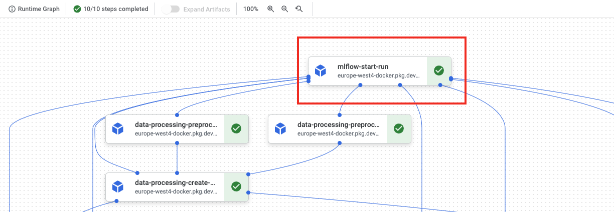

# Mlflow support

If you use [MLflow](https://mlflow.org/) and [kedro-mlflow](https://kedro-mlflow.readthedocs.io/) for the Kedro pipeline runs monitoring, the plugin will automatically enable support for:

* starting the experiment when the pipeline starts,
* logging all the parameters, tags, metrics and artifacts under unified MLFlow run.

To make sure that the plugin discovery mechanism works, add `kedro-mlflow` and `kedro-vertexai` as a dependencies to `src/requirements.txt` and run:

```console
$ pip install -r src/requirements.txt
$ kedro mlflow init
```

Then, adjust the kedro-mlflow configuration and point to the mlflow server by editing `conf/base/mlflow.yml` and adjusting `server.mlflow_tracking_uri` key. Then, build the image:

```console
$ kedro docker build
```

And re-push the image to the remote registry. 
And verify how does it look in the Kubeflow UI. You should notice `mlflow-start-run` step on the very top.



Finally, start the pipeline. While it executes, the new Mlflow run is started and it's constantly updated with the attributes provided by the next steps. Finally, the experiments runs page looks like:


The UI presents the pipeline status (in form of the icon) and latest node that was run (for failed runs in indicates at what step did the pipeline fail). Also, the `vertexai_run_id` and `vertexai_job_name` tags can be used to correlate Mlflow run with the Vertex AI pipeline execution.

## Authorization
For MLflow deployments that are secured with some authorization mechanism, the requests being made need to (usually) have the `Authorization` header set. MLflow allows to plug-in custom headers via `request_header_provider` entry point. We rely on [official `kedro-mlflow` approach](https://kedro-mlflow.readthedocs.io/en/stable/source/04_experimentation_tracking/01_configuration.html#authentication-with-expiring-tokens).
We're providing 2 implementations of the `Authorization` header provider, which obtain ID token from Google's endpoints - either OAuth or IAM. Of course, you can implement your own authorization mechanism by inheriting from the `kedro_vertexai.auth.mlflow_request_header_provider.RequestHeaderProviderWithKedroContext` class.

### Authorization with a service account email and OAuth Client ID (IAM)
Works well with Identity-Aware-Proxy deployments of MLflow, such as [MLflow on App Engine](https://getindata.com/blog/deploying-mlflow-google-cloud-platform-using-app-engine/).

In the `mlflow.yml`
```yaml
server:
    # ... rest of the config
    request_header_provider:
        type: kedro_vertexai.auth.gcp.MLFlowGoogleIAMRequestHeaderProvider
        pass_context: true
        init_kwargs:
            client_id: <OAuth Client ID>
            service_account: <service account email>
```

### OAuth2.0 based authorization
In the `mlflow.yml`
```yaml
server:
    # ... rest of the config
    request_header_provider:
        type: kedro_vertexai.auth.gcp.MLFlowGoogleOauthRequestHeaderProvider
        pass_context: true
        init_kwargs:
            client_id: <OAuth Client ID>
```

In the `vertexai.yml`
```yaml
run_config:
  # ... rest of the config
  mlflow:
    request_header_provider_params:
      client_id: <OAuth Client ID>
```

### Custom authorization method
You can inherit from `kedro_vertexai.auth.mlflow_request_header_provider.RequestHeaderProviderWithKedroContext` class and extend it with your own authorization method. For example, if you want to use a custom header, you can do it like this:

```python
from kedro_vertexai.auth.mlflow_request_header_provider import RequestHeaderProviderWithKedroContext
from cachetools import cached, TTLCache

class MyCustomMLflowHeaderProvider(RequestHeaderProviderWithKedroContext):
    def in_context(self):
        # here, self.params will contain all values from the mlflow.yml:server.request_header_provider.init_kwargs dictionary
        return "my_auth_info" in self.params

    @cached(TTLCache(1, ttl=3600)) # it's a good practice to cache the token for some time
    def request_headers(self):
        token = obtain_your_token_here()
        return {"Authorization": f"Bearer {token}", "X-My-Custom-Header": self.params["my_auth_info"]}
```

In the `mlflow.yml`
```yaml
server:
    # ... rest of the config
    request_header_provider:
        type: path.to.your.MyCustomMLflowHeaderProvider
        pass_context: true # if you want to pass context. it must be named ``kedro_context`` in the ``__init__`` method of your custom ``request_header_provider``
        init_kwargs:
            my_kwarg: 1
```